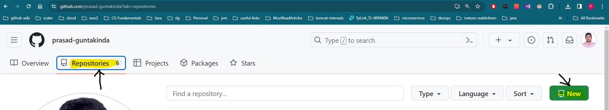
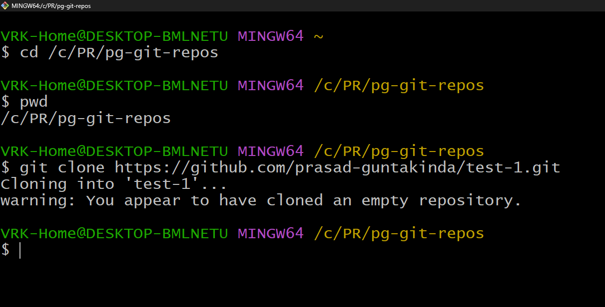

# How to Create & Contribute to Personal GitHub Repositories:

#### Pre-requisites:

1. Create a GitHub account on: https://github.com/ website
2. Install Git on your machine by following: https://git-scm.com/book/en/v2/Getting-Started-Installing-Git

___

### How to Create a Personal GitHub Repository?
1. Sign-In to https://github.com/ website
2. Select Repositories Tab, click on **New** button which appears at top-right corner

3. Once you click on **New** button it opens a new page like below:

4. Enter Repository Name above screenshot repo-name: test-1
5. You can add a description about the repository which is optional
6. You can define the visibility of your repository by choosing **Public** or **Private**
7. Finally, click on **Create Repository** button

8. If your screen is the same as above, then you have successfully created a remove repository with name **test-1**
9. Now we have two ways to add something to your remote git repository
   
         1. Clone empty Remote repository to local then add files and push it to remote
         2. Set newly created repository as a remote repository to the local repository

#### Option-1: Clone empty Remote repository to local then add files and push it to remote
- Option-1 is the easiest and mostly used one.
- First clone the remote repository to local. Goto your remote repository and copy repository URL.

- If you have already some files in the repo like `Readme.md` then you can find the git clone URL under **Code** button

- Open Git Bash CLI tool and go to local directory where you want to clone your remote repository.
- Otherwise, it is same as your git repo url with `.git` extension.

- Use `git clone __remote__repo__url__` cmd to clone remote repository
- After clone command, on your current directory a new directory with your remote repository name will be created.
- Goto repository by using change directory command
- And check the status of your current repo

- now create files or directories to your local repository

- After creating files if you use git status it will show all the files and folders in your current directory
- All the files which are in **RED** they are newly created but currently not tracked by your local git repository
- To track your files by local repo use `git add ` command, `git add .` means add all the files and directories to the local repo.
- After `git add ` if you check `git status` now you can see all the tracked files by local repo
- **GREEN** means tracked by local git repository but not yet committed 
- Use `git commit -m '__commit__message__'` to commit all the tracked files to local repository

- After commit if you check `git status` it shows `nothing to commit, working tree clean`
- Now all our changes are there in our local repository now we have to push our changes to remote repository, so that we can see our changes on  https://github.com/
- Use git push command to push your changes to remote repository.
- For the first time Push it will ask you to sign-in to remote repository

- After git push you can check your remote repository, all the pushed files will be available at your remote repository.

___

#### Option-2: Set newly created repository as a remote repository to the local repository
- If you have some files are already created or you have already a local git repository without a remote repo

- Above screenshot we have `html` directory and `app.js` files already created and there is no local repository created(mean no `.git` repo) in the current directory
- Now we first create a new local git repository by using `git init` command
- Goto local directory where your files are located and run `git init` command

- After `git init` command you can see that there is a `.git` folder created on you local directory, which represents local git repository.
- Now if you see `git status` all your files marked as a git untracked files and you are currently in local git `master` branch
- Now commit all the files to local git repository

- After commit, now we will link the remote repository to the current local repository by using `git remote add ` command

- After adding the remote, we will rename the branch name to match with remote branch name from local `master` to remote `main`
- Now we will push all our local repository changes to remote repository by using `git push ` command

- After `git push`, now we can see our changes on remote git repo  

___

#### References:
1. Official Git Website: https://git-scm.com/
2. Official Documentation: https://git-scm.com/book/
2. 
